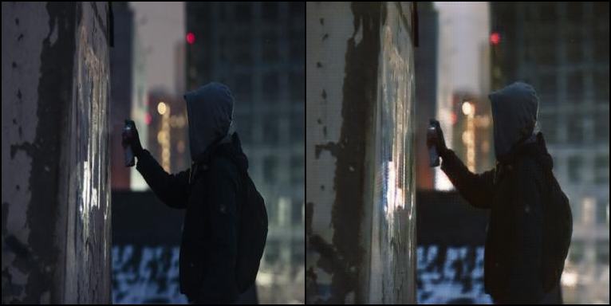
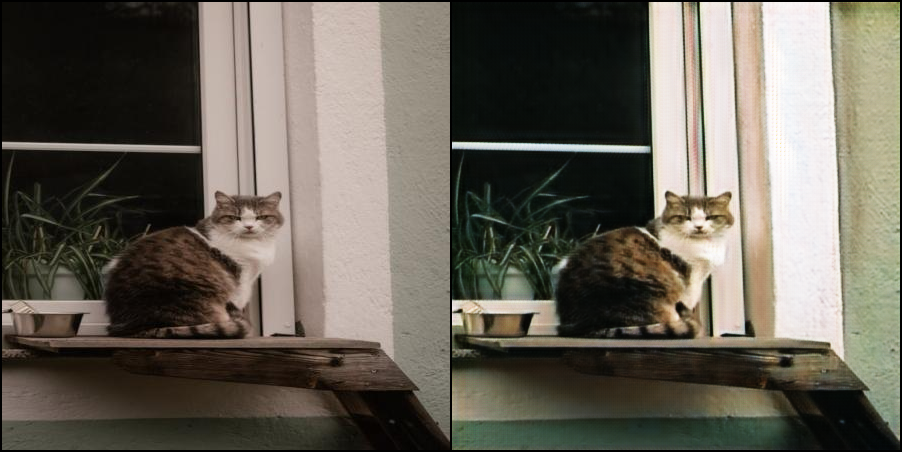
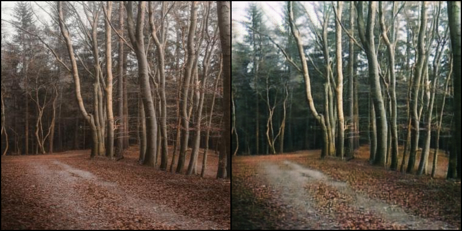
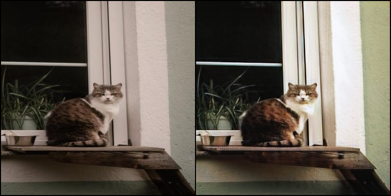

# DreamCam — CycleGAN for Camera Style Transfer
### Turning phone photos into film-style images — built out of curiosity, ended up working really well.

---

---

## Why I Built This

I started this project because I was curious about GANs. I kept reading about them but 
couldn't really understand how they worked until I built one myself.

The specific question that got me started: can a neural network learn the *feel* of film 
photography? Not just colour grading, but the grain, the contrast rolloff, the way shadows 
behave differently on film stock versus a smartphone sensor?

That question pulled me into CycleGAN, unpaired image translation, CUDA-accelerated training, 
and computer vision more broadly. I had no prior GAN experience going in. I learned everything 
on this project.

---

## What It Does

Takes a regular smartphone photo and transforms it into a cinematic film-style image — 
without needing paired training data. CycleGAN learns the *style* of film photography 
from unpaired examples and applies it to phone images while preserving the original 
scene content.

---

## Results

**Urban Night Scene**

  

**Indoor Window Light**

  

**Forest — Overcast Natural Light**

  

---

## Training Progression — Same Scene Across Epochs

One of the most interesting things I observed was how the model improved over training.
Early epochs produced checkerboard artifacts — a classic GAN issue caused by transposed 
convolution upsampling. These resolved significantly by epoch 190+.

| Epoch 120 | Epoch 210 |
|-----------|-----------|
|  |  |

---

## How It Works

CycleGAN uses two generators and two discriminators trained simultaneously:

- **Generator A→B**: Transforms phone photos → film style
- **Generator B→A**: Transforms film photos → phone style
- **Cycle consistency loss**: Ensures scene content is preserved during style transfer
- **Perceptual loss**: Added on top of standard CycleGAN to improve structural fidelity

---

## Stack

- **PyTorch** — model architecture and training
- **CUDA** — GPU-accelerated training

---

## What I Learned

- How GANs actually train — and why they're notoriously unstable
- The difference between paired and unpaired image translation
- Why cycle consistency loss is such an elegant solution to a hard problem
- How perceptual loss improves results beyond pixel-level metrics
- CUDA memory management during training
- Practical debugging of checkerboard artifacts, mode collapse, and vanishing gradients

This project made computer vision and deep learning click for me in a way that 
reading papers alone never would have.

---
## Known Limitations & Future Improvements

This was a learning project and the model has real limitations I'd like to address:

- **Checkerboard artifacts** appear in some outputs, particularly on flat surfaces and 
  skies. This is caused by transposed convolution upsampling and could be fixed by 
  replacing with resize-convolution layers.

- **Training instability** — GANs are notoriously hard to train and I experienced mode 
  collapse in early runs. Better learning rate scheduling and more careful 
  discriminator/generator balance would help.

- **Limited dataset diversity** — the model was trained on a relatively small dataset. 
  A larger, more diverse set of film photography examples would improve generalisation 
  across different scene types.

- **Resolution constraints** — high resolution images slow inference significantly. 
  A lighter generator architecture could improve speed without sacrificing too much quality.

## References

- [Unpaired Image-to-Image Translation using Cycle-Consistent Adversarial Networks](https://arxiv.org/abs/1703.10593) — Zhu et al., 2017
- [The Unreasonable Effectiveness of Deep Features as a Perceptual Metric](https://arxiv.org/abs/1801.03924) — Zhang et al., 2018
